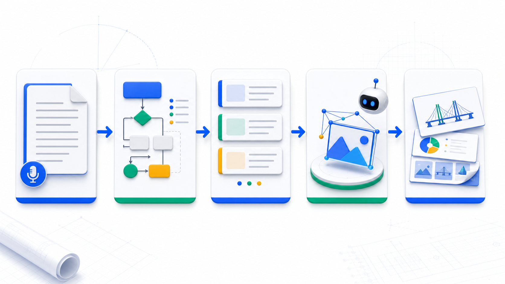
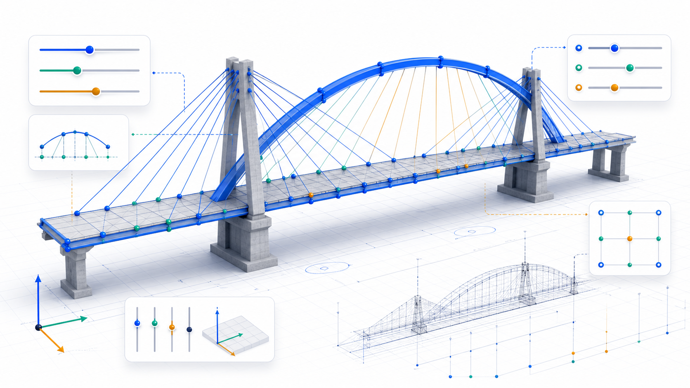
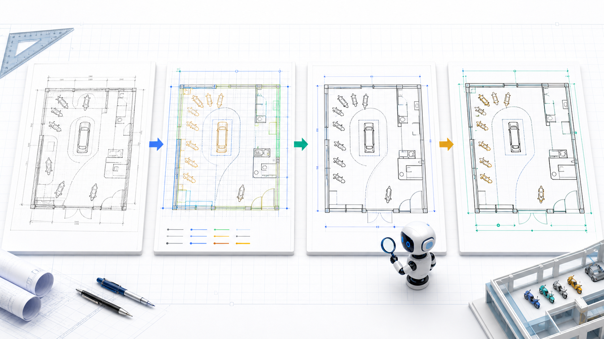

## AI辅助土木工程制图与桥梁模型生成实践分享 {.cover}

lecture-image-pack × Quarto RevealJS 测试

<h1>从逐字稿到汇报图</h1>

把 53 分钟技术分享拆成一组可讲、可展示、可继续生成图片的教学信息图页面。

## 01 skill 工作流：原始能力与本次适配

逐字稿

规划

Prompt

Image Gen

汇报图

## 02 分享内容地图

AI 辅助土木工程实践

<b>空间认知</b>三维模型辅助理解桥梁方向、构件与投影

<b>桥梁建模</b>用结构、坐标、参数约束生成可调模型

<b>CAD 复刻</b>从原图到规格化、重画、参数调整

<b>技能沉淀</b>把拱桥方法整理成 skill，扩展桥型

<b>展示应用</b>OBJ、PPT 平滑过渡、视频渲染与培训

## 03 问题引入：画图为什么让人头疼

<h3>传统重复制图</h3>
<ul>
<li>拓扑优化、改图、复核反复循环</li>
<li>图纸承载空间关系，学生不易直观看懂</li>
<li>修改参数常常意味着重画大量细节</li>
</ul>

→

<h3>AI 辅助实践</h3>
<ul>
<li>把结构拆成点、线、构件与参数</li>
<li>用三维可视化降低空间理解门槛</li>
<li>让参数变化驱动模型与图纸重生成</li>
</ul>

## 04 三维模型工具：补上空间认知这一环

正视俯视侧视

<b>可导入模型</b>桥梁 OBJ / STL 进入网页工具后可多角度观察。

<b>可看三视图</b>把抽象图纸转换成可旋转、可投影的空间对象。

<b>服务教学</b>帮助学生建立横向、纵向、支座、构件之间的空间关系。

## 05 参数化桥梁模型：从描述到可调对象

结构描述

坐标约束

参数调整

工程导出

## 06 提示词精度：把歧义压到最低

<b>结构组成</b>
桥面、拱肋、吊杆、索塔、支座分别是什么。

<b>位置关系</b>
谁连接谁，谁在上、下、两侧、跨中。

<b>坐标约束</b>
用关键点、间距、比例约束模型骨架。

<b>输出格式</b>
要求 HTML 模型代码、节点坐标和单元信息。

“任何复杂的桥梁，它不过就是点和线，点和线的一个连接。”

## 07 模型到 PPT：OBJ 与平滑过渡

<iframe class="bridge-frame" src="models/basket-arch-parametric.html?embed=1&span=60&arch=20&spacing=4" title="参数可调提篮拱桥三维模型"></iframe>

<h3>嵌入式参数模型</h3>

<b>可旋转</b>拖动模型查看桥向、横桥向和竖向关系。

<b>可调参</b>跨度、拱高、横梁间距会实时重建模型。

<b>可导出</b>支持节点/单元信息和 OBJ 模型导出。

<b>可讲解</b>RevealJS 页面保留上下文，模型承担现场演示。

## 08 skill 沉淀：从拱桥到桥型族

拱桥 prompt

结构拆分

常规比例

可调参数

输出契约

斜拉桥 skill

悬索桥 skill

异形桥梁 skill

<svg class="network-lines" viewBox="0 0 1000 430" preserveAspectRatio="none">
<path d="M500 90 L250 180 M500 90 L420 210 M500 90 L590 210 M500 90 L750 180" />
<path d="M420 260 L260 350 M500 270 L500 350 M590 260 L740 350" />
</svg>

## 09 CAD 复刻案例：核心不是照抄，是可变

原图

规格化

重画

参数调整

项目目标：让甲方看到修改过程，也让后续门店拓展能复用同一套参数逻辑。

## 10 CAD 自动绘图演示

参考图<b>斜拉桥</b>

修改变量<b>主跨跨度</b>

输出结果<b>整图重画</b>

残留问题<b>部分拉索细节</b>

AI 已能自动区分图层并复刻跨度尺寸，人工关注点转向误差核验与工程表达。

## 11 层级展示：从构件到城市

<b>局部构件</b>节点、索、梁、支座

<b>整体桥梁</b>桥型、受力路径、参数变化

<b>场景系统</b>道路、城市、地球尺度展示

汇报顺序可以按教学逻辑“局部到整体”，也可以按招投标逻辑“场景到细节”。

## 12 应用扩展：模型不只用于看

<b>有限元计算</b>用节点坐标直接计算挠度、弯矩

<b>3D 打印</b>调整粗细、连接和支撑约束

<b>视频渲染</b>对桥梁模型做一镜到底展示

<b>培训素材</b>用短视频快速生成演示片段

## 13 身份转换：学习目标的变化

<b>技术小白</b>需要长期积累后才能操作复杂任务

→

<b>领域实践者</b>借助 AI、skill 和可视化工具驾驭复杂任务

“学习最重要的不是继续成为你自己，而是完成身份转换。”

## 14 落地清单：把分享变成训练任务

01<b>选一个桥型</b>
先从结构清晰的拱桥或斜拉桥开始。

02<b>写清点线关系</b>
列构件、坐标、连接、比例和可调参数。

03<b>生成可交互模型</b>
要求输出网页模型并保留参数入口。

04<b>导出工程信息</b>
OBJ、节点坐标、单元信息分别服务展示和计算。

05<b>沉淀为 skill</b>
把成功提示词和 QA 标准固化为可复用能力。

